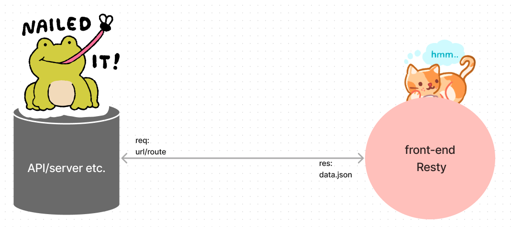

# Resty - Modern API Testing Tool

Resty is a user-friendly web application designed to simplify API testing and debugging. Built with React and utilizing the power of Axios for making HTTP requests, Resty is a versatile tool for developers and testers to interact with APIs effortlessly. With the help of React hooks like useState, useEffect, and useReducer, Resty provides a smooth and responsive user experience.

## Features
User-Friendly Interface: Resty offers an intuitive user interface that allows you to create, edit, and manage API requests effortlessly.

HTTP Request Support: Perform GET, POST, PUT, DELETE, and other HTTP requests with ease.

Request History: Resty keeps a record of your request history, making it easy to revisit and reuse previous requests.

Real-time Responses: View API responses in real-time, making it easier to debug and inspect data.

## Getting Started

Follow these steps to get Resty up and running on your local machine:

## Clone the Repository:

git clone https://github.com/rhettb253/resty.git

cd resty

### Install Dependencies:

npm install

### Start the Development Server:

npm run dev

### Open Your Browser:

Resty will be accessible at http://localhost:5173.

## Usage

### Create a New Request:

Choose the HTTP method (GET, POST, PUT, DELETE).
Enter the URL of the API endpoint.

For POST or PUT requests, enter the request body in JSON format.

### Send the Request:

Click the "Go" button to make the API request.
View the response in the "Response" section below.

### View Request History:

On the right view the "History" tab to see a list of recent requests.

Click on a request to load and edit it.

## Cute UML

